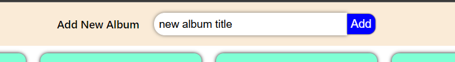

## Hosted Link -- https://album-manager-8461b.web.app

# Video

[](https://www.youtube.com/watch?v=7vuCmG_Tq00)

### Description

`learn how to manage api in react redux`

## React Album

## Folder Structure

```
album-manager
├─ .git
├─ .gitignore
├─ package-lock.json
├─ package.json
├─ public
│  ├─ favicon.ico
│  ├─ index.html
│  ├─ logo192.png
│  ├─ logo512.png
│  ├─ manifest.json
│  └─ robots.txt
├─ README.md
└─ src
   ├─ action
   │  └─ index.js
   ├─ api
   │  └─ index.jsg
   ├─ components
   │  ├─ AlbumCard.js
   │  ├─ App.js
   │  └─ NavBar.js
   ├─ index.css
   ├─ index.js
   └─ reducer
      └─ index.js

```

## Some ScreenShots of Project


`by clicking on update we can update the title`


## we can create new Album



